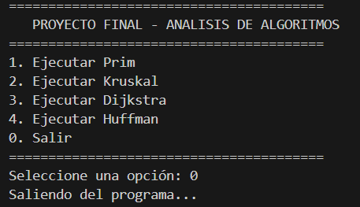
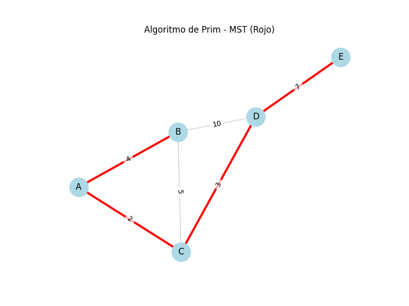
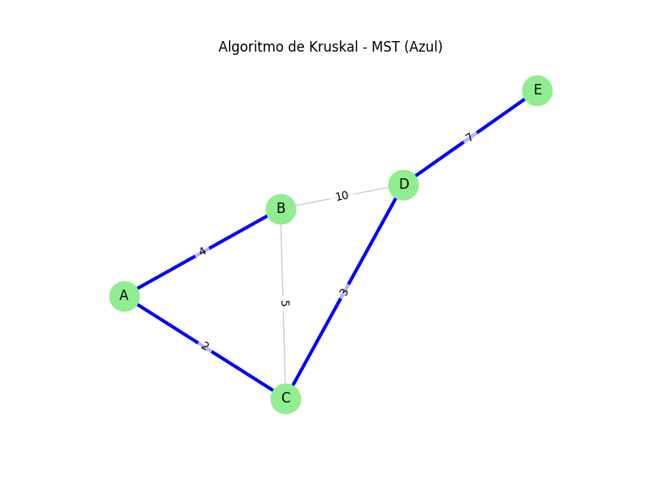
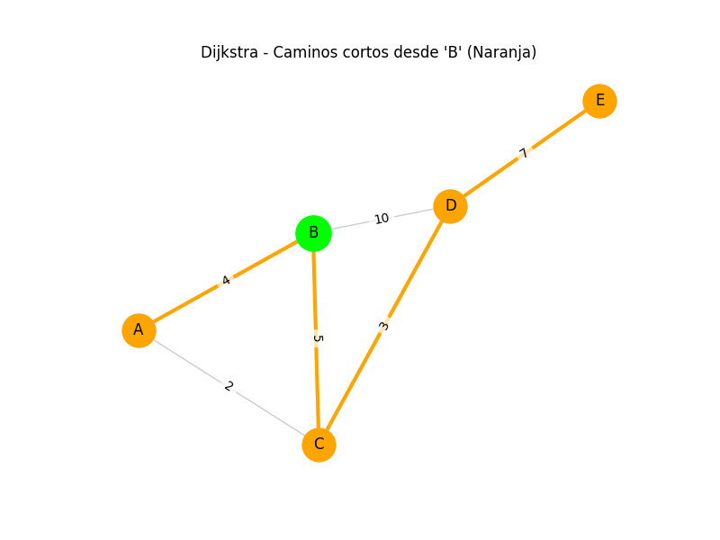
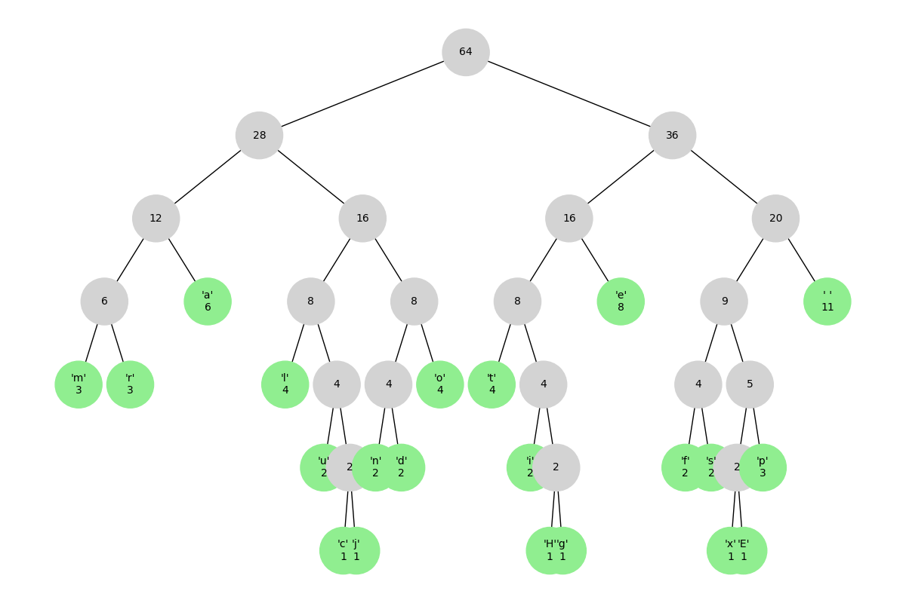
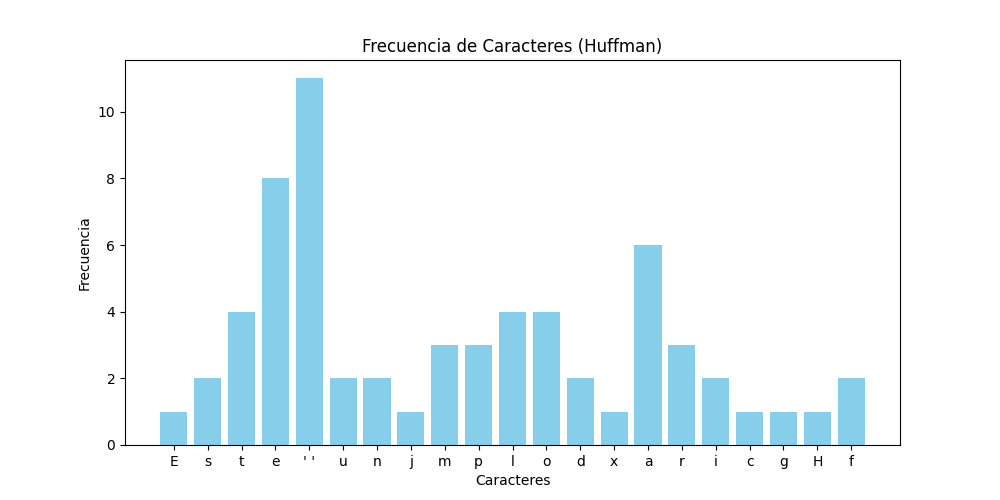

# Proyecto Final - Análisis de Algoritmos

* **Universidad:** Universidad Da Vinci de Guatemala
* **Curso:** Análisis de Algoritmos
* **Proyecto:** Proyecto Final
* **Nombre:** Spike Monroy
* **Carnet:** 202302407  
* **Fecha:** 3/12/2025

---

## 1. Objetivos

### General
Desarrollar un sistema integral que implemente y visualice los algoritmos de Prim, Kruskal, Dijkstra y Huffman, utilizando un flujo de trabajo con Gitflow y generando evidencia gráfica del procesamiento.

### Específicos
* Implementar algoritmos de grafos (MST y ruta más corta) y compresión de texto.
* Visualizar los resultados mediante librerías gráficas (Matplotlib/NetworkX).
* Gestionar el control de versiones utilizando la metodología Gitflow.
* Documentar el análisis de complejidad temporal de cada solución.

---

## 2. Explicación y Complejidad de Algoritmos

### A. Algoritmo de Prim
* **Teoría:** Construye un Árbol de Expansión Mínima (MST) partiendo de un nodo arbitrario y agregando siempre la arista de menor peso que conecte un nodo visitado con uno no visitado.
* **Complejidad:** $O(E \log V)$ usando Binary Heap.

### B. Algoritmo de Kruskal
* **Teoría:** Construye el MST ordenando todas las aristas por peso de menor a mayor y agregándolas al conjunto si no forman un ciclo (verificado mediante la estructura Union-Find).
* **Complejidad:** $O(E \log E)$ o $O(E \log V)$.

### C. Algoritmo de Dijkstra
* **Teoría:** Encuentra los caminos más cortos desde un nodo origen a todos los demás nodos del grafo, utilizando una estrategia voraz (greedy) y una cola de prioridad.
* **Complejidad:** $O(E \log V)$.

### D. Algoritmo de Huffman
* **Teoría:** Algoritmo de compresión sin pérdida que asigna códigos binarios de longitud variable a los caracteres, basándose en la frecuencia de aparición (los más frecuentes tienen códigos más cortos).
* **Complejidad:** $O(n \log n)$, donde $n$ es el número de caracteres únicos.

---

## 3. Ejecución del Programa

### Requisitos
* Python 3.x
* Librerías: `matplotlib`, `networkx`

### Instrucciones
1.  Clonar el repositorio.
2.  Crear entorno virtual: `python -m venv venv`
3.  Activar entorno: `.\venv\Scripts\activate`
4.  Instalar dependencias: `pip install -r requirements.txt`
5.  Ejecutar el menú principal:
    ```bash
    python main.py
    ```




### Formato de Entrada
* **Grafos (CSV):** `origen,destino,peso`
* **Texto (TXT):** Texto plano para compresión.

---

## 4. Resultados Gráficos (Evidencias)

### Prim (MST)


### Kruskal (MST)


### Dijkstra (Caminos Cortos)


### Huffman (Árbol y Frecuencias)



---

## 5. Flujo Gitflow Aplicado
Se utilizó la metodología Gitflow con las siguientes ramas:
* `main`: Rama de producción principal.
* `develop`: Rama de integración de desarrollo.
* `feature/prim`: Implementación de Prim.
* `feature/kruskal`: Implementación de Kruskal.
* `feature/dijkstra`: Implementación de Dijkstra.
* `feature/huffman`: Implementación de Huffman.
* `release/v1.0.0`: Preparación de la versión final.
* `hotfix/...`: Correcciones rápidas sobre producción.

---

## 6. Conclusiones
* La implementación modular permite mantener el código ordenado y escalable.
* El uso de estructuras de datos eficientes (Heaps, Union-Find) es crítico para cumplir con los tiempos de ejecución teóricos.
* Gitflow facilita el desarrollo paralelo y ordenado, dejando un historial claro de cada funcionalidad agregada.
* Aunque Prim y Kruskal resuelven el mismo problema, su enfoque difiere. Se concluye que Prim es más eficiente en grafos densos, donde el número de aristas es alto, ya que crece desde un nodo inicial, mientras que Kruskal es ideal para grafos dispersos al trabajar ordenando aristas globales.
* La implementación de Dijkstra demostró la importancia de las colas de prioridad (Heaps). Sin esta estructura, la búsqueda del nodo con menor distancia sería lineal, elevando drásticamente el tiempo de ejecución. El algoritmo garantiza la ruta óptima siempre que no existan pesos negativos.
* El algoritmo de Huffman ilustra eficazmente el concepto de códigos prefijos. Al asignar secuencias binarias más cortas a los caracteres más frecuentes, se logra reducir el tamaño del archivo sin perder información, validando su uso en formatos de compresión reales.